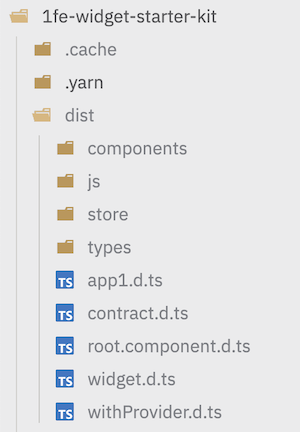

import { SlCloudDownload, SlPencil, SlRocket } from "react-icons/sl";
import { FcOk } from "react-icons/fc";

Let's customize your new 1FE app by making changes to the default plugin! Since 1FE is powered by CDN, we will update and build the plugin and publicly host the assets.

## <SlPencil style={{ display: 'inline', marginRight: '0.5rem', verticalAlign: 'middle' }} /> Make changes to example plugin

##### 1. Make any content change to `1fe-widget-starter-kit/src`

```tsx title="1fe-widget-starter-kit/src/app1.tsx" {10}
import { platformProps } from '@devhub/1fe-shell';
import React, { useEffect } from 'react';
import { Router as Widget } from './components/router';
import { withProvider } from './withProvider';
import { WidgetProps } from './contract';

const RootWrapper: React.FC<WidgetProps> = (props) => {
  useEffect(() => {
    platformProps.utils.appLoadTime.end();
    console.log('Hello from app1!');
  }, []);

  return <Widget {...props} />;
};

export default withProvider(RootWrapper);

```

##### 2. Build the plugin within `1fe-widget-starter-kit` directory

:::caution
**Keep your 1FE app running in the background**.

1FE CLI will need the development server for the build process. This will later be pointed to a deployed environment once your 1FE app is hosted.
:::

```bash
# 1fe
cd 1fe-widget-starter-kit
yarn build:widget
```

:::tip
1FE CLI will build the widget. Observe the assets within the `dist` folder.
:::

  


## <SlCloudDownload style={{ display: 'inline', marginRight: '0.5rem', verticalAlign: 'middle' }} /> "Deploy" your plugin to a CDN

To get started quickly, we can use github's mirrored assets on the jsdelivr CDN.

##### 1. Fork this [mock-cdn-assets](https://github.com/docusign/mock-cdn-assets/tree/main) repository

##### 2. Upload the new assets to your forked mocked-cdn-assets repository
1. Create a new directory within `development/widgets/@1fe/starter-kit` of your forked repo. The directory name should be the next bumped version. (e.g `1.0.2`).

2. Upload the contents of the `1fe-widget-starter-kit/dist/` directory to the new directory.


3. Push these changes to your forked repository.

4. Confirm that the assets are publicly accessible by visiting this jsdelivr cdn location. Replace with your gh username and version:
```
https://cdn.jsdelivr.net/gh/<your-github-username>/mock-cdn-assets/development/widgets/@1fe/starter-kit/<version>/js/1fe-bundle.js
```

##### 3. Update the Live Configurations to find your new plugin assets

1. Locate `common-configs/development.json` within your forked mock-cdn-assets repository.

2. Under `cdn.libraries.basePrefix` and `cdn.widgets.basePrefix`, update the base prefix to point to your jsdelivr cdn.

```json title="common-configs/development.json" {4,8}
{
  "cdn": {
    "libraries": {
      "basePrefix": "https://cdn.jsdelivr.net/gh/<your-github-username>/mock-cdn-assets/development/libs/",
      {...}
    },
    "widgets": {
      "basePrefix": "https://cdn.jsdelivr.net/gh/<your-github-username>/mock-cdn-assets/development/widgets/",
      {...}
    }
  }
}
```

3. Under `cdn.widgets.releaseConfig`, locate the widgetId `@1fe/starter-kit` and update with the new version.

```json title="common-configs/development.json" {8}
...
{
  "widgetId": "@1fe/starter-kit",
  "plugin": {
      "enabled": true,
      "route": "/app1"
  },
  "version": "1.0.2"
}
```

4. Push these changes to your forked repository.

5. Confirm that the update Live Configurations is reflected on jsdelivr: `https://cdn.jsdelivr.net/gh/<your-github-username>/mock-cdn-assets/common-configs/development.json`.

:::tip
**Is jsdelivr not reflecting your changes?**

Try purging the cache here: https://www.jsdelivr.com/tools/purge. This may take a few minutes to apply.
:::

Read more about [Live Configurations](../../main-concepts/live-configurations).

##### 4. Point your local 1FE app to the new CDN assets

```tsx title="apps/starter-app/src/server.ts" {7}
// ...
const options = {
  mode: envModeMap[ENVIRONMENT],
  environment: ENVIRONMENT,
  orgName: '1FE Starter App',
  configManagement: {
    url: `https://cdn.jsdelivr.net/gh/abe-hu/mock-cdn-assets/common-configs/development.json`,
    refreshMs: 30 * 1000,
  },
  shellBundleUrl,
  // ...
};

const app = oneFEServer(options);
```

##### <FcOk style={{ display: 'inline', marginRight: '0.5rem', verticalAlign: 'middle' }} /> Tada!


:::note
**In an ideal-state:**
- There should be proper CDN hosting for Live Configurations and widget assets.
- Each widget should live in their own repository.
- Each widget should own CI/CD pipelines that upload assets to CDN and bump release versions on merge. (Templates Coming Soon! <SlRocket style={{ display: 'inline', marginRight: '0.5rem', verticalAlign: 'middle' }} /> )
:::
