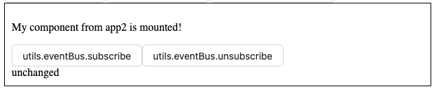

import { SlSocialDropbox, SlAnchor, SlCloudDownload } from "react-icons/sl";

## <SlSocialDropbox style={{ display: 'inline', marginRight: '0.5rem', verticalAlign: 'middle' }} /> Starter Plugin

##### 1. Visit `http://localhost:3001/widget-starter-kit/utils` to view the example starter plugin

##### 2. Click the button `utils.context.get`
  

##### 3. What just happened?

1. 1FE loaded and rendered the *plugin* tied to the `/widget-starter-kit` route.

2. When `utils.context.get` was clicked, the plugin loaded a child *widget* via the *platform utilities* provided by 1FE shell.

:::tip
1FE loads the latest widget bundles and assets from a CDN. This allows for a dynamic ecosystem where monolithic apps can be broken into smaller plugins and widgets repositories, each with their own release cycles. This is a key feature of 1FE.
:::

Read more about [widgets and plugins](../../main-concepts/widgets) and [platform utilities](../../development/platform-utilities/overview/).

##### 3. (Optional) Explore the other Platform Utilities that 1FE shell offers
