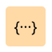
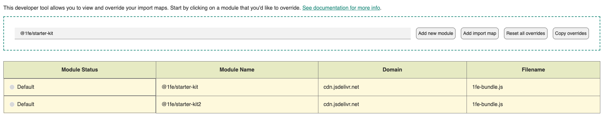
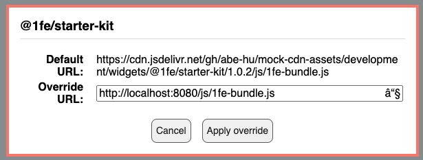

import { SlWrench } from "react-icons/sl";
import { FcOk } from "react-icons/fc";

## <SlWrench style={{ display: 'inline', marginRight: '0.5rem', verticalAlign: 'middle' }} /> Need to develop locally?

##### 1. Run `yarn dev` in `widgets/app1`

```bash
cd widgets/app1 && yarn dev
```

1FE CLI will serve the widget bundle at `http://localhost:8080/js/1fe-bundle.js`

##### 2. Visit `http://localhost:3001/app1` and click the `{...}` button at the bottom right corner of the screen. 

##### 3. Search for `@1fe/starter-kit` within the shelf and select the matching module



##### 4. In the `Override URL` field, enter `http://localhost:8080/js/1fe-bundle.js` and click `Apply override`.



##### 5. <FcOk style={{ display: 'inline', marginRight: '0.5rem', verticalAlign: 'middle' }} /> Make changes toy our widget and observe the changes in the browser.
