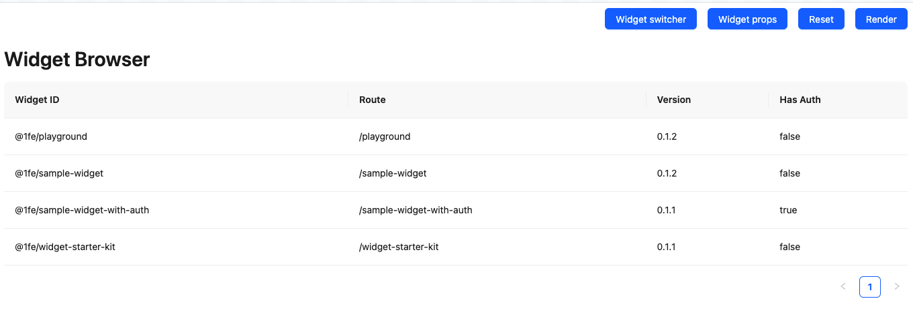

import {
  FcEngineering,
  FcFlashOn,
  FcServices,
  FcSettings,
} from "react-icons/fc";
import playgroundScreenshot from "../../../assets/playground.png";

## 🛝 What is the 1fe Playground?

The **1fe Playground** is a powerful development sandbox that provides an isolated environment for testing and validating widgets within the 1fe ecosystem. Think of it as a dedicated space where widget developers can experiment, test, and iterate on their widgets without requiring the full shell or host plugin setup.



## 🎯 Why Platform Teams Should Offer the Playground

The Playground is an **essential plugin** that platform teams should deploy because it provides significant benefits for both development velocity and developer experience:

<div class="prose">

### **🚀 Developer Benefits**

- **Lower barrier to entry**: Start widget development immediately without complex setup
- **Isolated testing environment**: Validate widget behavior without interference from other components
- **Real runtime environment**: Test with actual 1fe infrastructure and platform utilities

### **🛠️ Platform Team Benefits**

- **Reduced support burden**: Developers can self-serve for widget testing and validation
- **Faster onboarding**: New teams can start building widgets immediately
- **Quality assurance**: Developers can validate widgets before integration
- **Development standardization**: Consistent testing environment across all teams

</div>

## ⚡ Core Features

The 1fe Playground provides several powerful features for widget development:

### 1. Widget Browser

Browse and discover all available widgets in your 1fe ecosystem:

<div class="prose">

- **Widget catalog**: View all registered widgets with their IDs, routes, and versions
- **Authentication info**: See which widgets require authentication
- **Plugin details**: Understand widget configurations and capabilities
- **Quick navigation**: Easily switch between different widgets for testing

</div>

### **2. Widget URL Overrides** 🎯

The most powerful feature for active development - dynamically load widgets from any URL:

<div class="prose">

- **Local development**: Load widgets directly from your local development server (`http://127.0.0.1:8080/js/1fe-bundle.js`)
- **PR testing**: Test widget builds from pull request preview deployments
- **Version comparison**: Compare different widget versions side-by-side

</div>

**How Widget URL Overrides Work:**

When you override a widget URL, the Playground:

<div class="prose">

1. **Bypasses** the normal widget loading mechanism
2. **Loads** your widget bundle directly from the specified URL
3. **Provides** the same runtime environment and platform utilities
4. **Maintains** all 1fe guarantees (dependencies, execution context, etc.)

</div>

This enables **true hot module replacement** where you can see changes instantly as you develop locally.

### 3. Props Editor

Live editor for testing different widget configurations:

<div class="prose">

- **Real-time editing**: Modify widget props using a code editor with syntax highlighting
- **Experimentation**: Test edge cases and different prop combinations

</div>

### **4. Development Tools**

Built-in tools to enhance the development experience:

<div class="prose">

- **Keyboard shortcuts**: Quick access to common actions (Ctrl+/ for widget switcher, Ctrl+P for props editor)
- **Copy functionality**: Easily share playground URLs with specific widget configurations
- **Reset capability**: Quickly reset to a clean state when testing different scenarios

</div>

## 🔄 Common Development Workflows

### **Starting Widget Development**

Perfect for teams new to 1fe or building their first widget:

<div class="prose">

1. **Access the Playground** in your 1fe instance
2. **Browse existing widgets** to understand patterns and capabilities
3. **Start your local widget development** (`npx 1fe-cli dev`)
4. **Override the widget URL** to point to your local build
5. **Iterate rapidly** with immediate feedback

</div>

### **Testing Integration**

Validate how your widget works with others in the ecosystem:

<div class="prose">

- **Load your widget** alongside other production widgets
- **Test widget-to-widget communication** using platform utilities
- **Verify compatibility** with the broader 1fe ecosystem
- **Validate props interface** with real data structures

</div>

### **PR Validation**

Use the Playground to validate pull requests before merging:

<div class="prose">

- **Load PR builds** using CDN URLs from your CI/CD pipeline
- **Compare before/after** behavior by switching between versions
- **Share results** with stakeholders using playground URLs
- **Automate testing** by integrating playground URLs into your QA process

</div>

## ⚙️ Setup for Platform Teams

To enable the Playground in your 1fe instance:

### **1. Include the Playground Widget**

Add the playground to your widget configurations:

```json
{
  "widgetId": "@1fe/playground",
  "version": "latest"
}
```

### **2. Enable in 1fe Server**

Configure your 1fe server to enable the playground:

```typescript
export const serverConfig = {
  playground: true, // Enable playground functionality
  defaultRoute: "/playground", // Optional: make playground the default route
};
```

### **3. Deploy and Configure**

Deploy the playground widget bundle to your CDN and ensure it's included in your live configurations.

## 💡 Best Practices

<div class="prose">

### **For Widget Developers**

- **Start with the playground** before setting up complex local environments
- **Use URL overrides** for active development with immediate feedback
- **Test props variations** using the props editor to ensure robustness
- **Validate integration** with other widgets before requesting deployment

### **For Platform Teams**

- **Make playground the default route** in non-production environments
- **Document playground usage** in your team's onboarding materials

</div>

## 🔗 Related Resources

- **[Widget Development Guide](/learning/widgets/)** - Learn how to build widgets
- **[1fe Server Reference](/reference/1fe-server-reference/)** - Configure playground settings
- **[Live Configurations](/learning/live-configurations/)** - Understand widget deployment
