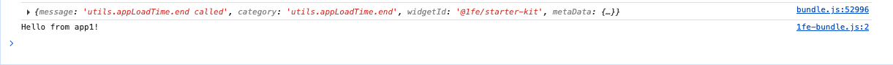

import { FcOk } from "react-icons/fc";

Let's build a complete 1fe proof of concept. You'll create a local 1fe instance, develop a widget using the playground, and deploy everything to production.

This tutorial is designed for platform teams evaluating [micro-frontend solutions](/learning/why-1fe/) for their organization.

**Prerequisites:** Node.js 22+, yarn 4+, and access to deploy applications.

## What We're Building

**[🔧 Create Your 1fe Instance](#🔧-create-your-1fe-instance)** - Set up a local 1fe instance from scratch  
**[🛠️ Develop Your First Widget](#🛠️-develop-your-first-widget)** - Create and develop a widget using the playground  
**[🚀 Deploy Your Proof of Concept](#🚀-deploy-your-proof-of-concept)** - Deploy your instance to a production-like environment

Let's start building.

---

## 🔧 Create Your 1fe Instance

Let's create your 1fe instance from scratch. A [1fe instance](/learning/what-is-1fe/) is a micro-frontend platform that hosts independent widgets.

**1. Scaffold a starter application:**

```bash
npx @1fe/create-1fe-app my-1fe-poc
```

**2. Clone the widget starter kit:**

```bash
git clone https://github.com/docusign/1fe-widget-starter-kit.git
```

**3. Set up both repositories:**

```bash
# Build the 1fe instance
cd my-1fe-poc
yarn && yarn build

# Set up the widget starter kit
cd ../1fe-widget-starter-kit
yarn
```

### Start Development Servers

**4. Run the 1fe instance:**

```bash
cd my-1fe-poc
yarn dev
```

Your instance is now running at [http://localhost:3000](http://localhost:3000).

**5. Run the widget development server:**

```bash
cd 1fe-widget-starter-kit
yarn dev
```

This opens the [widget playground](http://localhost:3001/playground?widgetUrl=http%3A%2F%2F127.0.0.1%3A8080%2Fjs%2F1fe-bundle.js) where you can develop and test widgets.

You now have a complete 1fe development environment running locally!

---

## 🛠️ Develop Your First Widget

Great! You now have a working 1fe instance. Let's dive into the development experience by creating and customizing widgets.

### Explore the Local 1fe Instance

**Test the sample widgets:**

1. **Visit `http://localhost:3001/widget-starter-kit/utils` to view the example starter plugin**
2. **Click the button `utils.context.get`**
   
3. **What just happened?**
   - 1fe loaded and rendered the plugin tied to the `/widget-starter-kit` route
   - When `utils.context.get` was clicked, the plugin loaded a child widget via [platform utilities](/reference/platform-utilities/overview/)

:::tip[The Magic Behind the Scenes]
1fe loads the latest widget bundles and assets from a CDN, enabling dynamic loading so your widgets can update independently without touching the main app! [Discover how this magic works](/learning/externalized-libraries/).
:::

### Override Widget with Your Local Plugin

Let's override the example plugin to use our plugin running locally.

1. **If not already running, run `yarn dev` in `1fe-widget-starter-kit/`**

   ```bash
   cd 1fe-widget-starter-kit
   yarn dev
   ```

2. **Visit `http://localhost:3001/widget-starter-kit` and click the `{...}` button at the bottom right corner of the screen**
   

3. **Search for `@1fe/widget-starter-kit` within the shelf and select the matching module**
   

4. **In the `Override URL` field, enter `http://localhost:8080/js/1fe-bundle.js` and click `Apply override`**
   

5. **Make changes to your widget and observe the changes in the browser**

### Customize Your 1fe Instance

Now let's look at how to host your plugin locally so it shows up by default in the 1fe instance.

**Build plugin assets:**

1. **Make any content change to `1fe-widget-starter-kit/src`**

   ```tsx title="1fe-widget-starter-kit/src/app1.tsx"
   import { platformProps } from "@1fe/shell";
   import React, { useEffect } from "react";
   import { Router as Widget } from "./components/router";
   import { withProvider } from "./withProvider";
   import { WidgetProps } from "./contract";

   const RootWrapper: React.FC<WidgetProps> = (props) => {
     useEffect(() => {
       platformProps.utils.appLoadTime.end();
       console.log("Hello from app1!");
     }, []);

     return <Widget {...props} />;
   };

   export default withProvider(RootWrapper);
   ```

2. **Build the plugin within `1fe-widget-starter-kit` directory**
   :::caution
   **Keep your 1fe instance running in the background**. 1fe CLI will need the development server for the build process.
   :::

   ```bash
   cd 1fe-widget-starter-kit
   yarn build:widget
   ```

   

**Setup the playground widget:**

1. **Fork the [1fe-playground](https://github.com/docusign/1fe-playground) repository to your GitHub account**

   ```bash
   git clone https://github.com/<your-github-username>/1fe-playground.git
   cd 1fe-playground
   ```

2. **Install dependencies and build the widget:**
   ```bash
   yarn install
   yarn build:widget
   ```

**Host the widgets locally:**

1. Fork the [mock-cdn-assets](https://github.com/docusign/mock-cdn-assets/tree/main) repository
2. Create a new directory within `integration/widgets/@1fe/widget-starter-kit` of your forked cdn repo. The directory name should be the version from the package.json of the widget-starter-kit repository (e.g `1.0.2`)
3. Upload the contents of the `1fe-widget-starter-kit/dist/` directory to the new directory
4. Create a new directory within `integration/widgets/@1fe/playground` of your forked cdn repo. The directory name should be the version from the package.json of the playground repository (e.g `1.0.50`)
5. Upload the contents of the `1fe-playground/dist/` directory to the playground directory. Following is an image which showcases what the directory structure will look like after you have moved the code over:
   
6. Serve them locally using the serve package:
   ```bash
   npx serve -C <root-of-cdn-assets-repo-locally>
   ```

**Use the new widget assets in our 1fe instance:**

One of the key features of 1fe is the ability to dynamically load widgets and plugins via [Live Configurations](/learning/live-configurations). Let's take advantage of these configurations.

**Update widget-versions.json:**

Create `integration/configs/widget-versions.json` file within your forked mock-cdn-assets repository:

```json title="widget-versions.json"
[
  {
    "widgetId": "@1fe/playground",
    "version": "<version of the bundle we moved to mock-cdn-assets>"
  },
  {
    "widgetId": "@1fe/widget-starter-kit",
    "version": "<version of the bundle we moved to mock-cdn-assets>"
  }
]
```

**Update live.json:**

Locate `integration/configs/live.json` within your forked mock-cdn-assets repository and make the following changes:

```diff title="live.json"
{
+ "libraries": {
+   "basePrefix": "http://localhost:3000/integration/libs/"
+ },
  "widgets": {
+   "basePrefix": "http://localhost:3000/integration/widgets/",
    "configs": [
      {
        "widgetId": "@1fe/playground",
        "plugin": {
          "enabled": true,
          "route": "/widget-starter-kit"
        }
      },
-     {
-       "widgetId": "@1fe/sample-widget",
-       "plugin": {
-         "enabled": true,
-         "route": "/sample-widget"
-       }
-     },
-     {
-       "widgetId": "@1fe/sample-widget-with-auth",
-       "plugin": {
-         "enabled": true,
-         "route": "/sample-widget-with-auth",
-         "auth": {
-           "authenticationType": "required"
-         }
-       }
-     }
    ]
  }
}
```

**Point your local 1fe instance to the new CDN assets:**

Update the `src/config/ecosystem-configs.ts` file:

```tsx title="src/config/ecosystem-configs.ts"
// ...
export const configManagement: OneFEConfigManagement = {
  widgetVersions: {
    url: `http://localhost:3000/integration/configs/widget-versions.json`,
  },
  libraryVersions: {
    url: `http://localhost:3000/integration/configs/lib-versions.json`,
  },
  dynamicConfigs: {
    url: `http://localhost:3000/integration/configs/live.json`,
  },
  refreshMs: 30 * 1000,
};
```

Navigate to [starter kit locally](http://localhost:3001/widget-starter-kit/utils) and check the console for the message "Hello from app1!" to confirm that your changes are being reflected.

##### <FcOk style={{ display: 'inline', marginRight: '0.5rem', verticalAlign: 'middle' }} /> Tada!



:::note[CSP Gone Wrong!]
If you refresh the page and see Content Security Policy errors blocking you from loading assets, you need to update the CSP settings in the 1fe instance (`src/csp-configs.ts`) to allow them (`http://localhost:3000/`).
:::

You now have a fully functional local 1fe instance with custom widgets!

---

## 🚀 Deploy Your Proof of Concept

Perfect! You've set up your 1fe instance and experienced the development workflow. Let's deploy your proof of concept to production to create a live demo for stakeholders.

:::caution
**This is a POC deployment guide!** We're using public tooling to get something on the internet quickly. For production environments with proper CDN infrastructure, CI/CD pipelines, and robust hosting, visit our [productionization guide](/tutorials/productionize-your-1fe-instance/).
:::

### Setup Required GitHub Repositories

You need two GitHub repositories:

**CDN Assets Repository** - For the `mock-cdn-assets` that will hold our assets. We'll use JSDelivr to serve these assets.

**1fe Instance Repository** - For your 1fe instance that will be used to deploy your 1fe instance.

### ☁️ Deploy Assets to CDN

**Configure the 1fe instance first:**

Let's assume you're going to use a git tag for your CDN assets like `v1.0.2`. Use `<tag>` to refer to this tag in the rest of this guide.

1. **Point your 1fe instance to the new CDN assets for live configurations:**

   ```tsx title="src/config/ecosystem-configs.ts"
   // ...
   export const configManagement: OneFEConfigManagement = {
     widgetVersions: {
       url: `https://cdn.jsdelivr.net/gh/<your-github-username>/<repo-name>@<tag>/integration/configs/widget-versions.json`,
     },
     libraryVersions: {
       url: `https://cdn.jsdelivr.net/gh/<your-github-username>/<repo-name>@<tag>/integration/configs/lib-versions.json`,
     },
     dynamicConfigs: {
       url: `https://cdn.jsdelivr.net/gh/<your-github-username>/<repo-name>@<tag>/integration/configs/live.json`,
     },
     refreshMs: 30 * 1000,
   };
   ```

2. **Point your 1fe instance to the new CDN assets for critical libraries:**

   ```tsx title="src/config/ecosystem-configs.ts"
   // ...
   const shellBundleUrl =
     isLocal || SERVER_BUILD_NUMBER === "local"
       ? `http://localhost:3001/js/bundle.js`
       : `https://cdn.jsdelivr.net/gh/<your-github-username>/<repo-name>@<tag>/${ENVIRONMENT}/shell/${SERVER_BUILD_NUMBER}/js/bundle.js`;

   const importMapOverrideUrl = isProduction
     ? `https://cdn.jsdelivr.net/gh/<your-github-username>/<repo-name>@<tag>/${ENVIRONMENT}/libs/@1fe/import-map-overrides/3.1.1/dist/import-map-overrides-api.js`
     : `https://cdn.jsdelivr.net/gh/<your-github-username>/<repo-name>@<tag>/${ENVIRONMENT}/libs/@1fe/import-map-overrides/3.1.1/dist/import-map-overrides.js`;

   export const criticalLibUrls = {
     importMapOverride: importMapOverrideUrl,
     systemJS: `https://cdn.jsdelivr.net/gh/<your-github-username>/<repo-name>@<tag>/${ENVIRONMENT}/libs/systemjs/6.14.0/dist/system.min.js`,
     systemJSAmd: `https://cdn.jsdelivr.net/gh/<your-github-username>/<repo-name>@<tag>/${ENVIRONMENT}/libs/systemjs/6.14.0/dist/extras/amd.min.js`,
     shellBundleUrl,
   };
   ```

3. **Update the CSP policy** in `src/csp-configs.ts` to allow jsdelivr domains (`https://cdn.jsdelivr.net`)

4. **Check this into your 1fe instance repository**

**Add the 1fe instance bundle to the CDN:**

1. **Build the 1fe instance again using `yarn build`**
2. **Copy the bundle over to your `mock-cdn-assets` repository:**
   ```bash
   mkdir -p mock-cdn-assets/integration/shell/<build-number>/
   cp -r my-1fe-poc/dist/public/ mock-cdn-assets/integration/shell/<build-number>/
   ```

**Create and Push Tags for JSDelivr:**

1. **Create and push a Git tag:**

   ```bash
   cd mock-cdn-assets
   git add .
   git commit -m "Add 1fe assets for deployment"
   git tag v1.0.2 # Use your chosen tag here
   git push origin main
   git push origin v1.0.2 # Push the tag to GitHub
   ```

2. **Your assets are now publicly accessible via JSDelivr URLs**

:::tip
**JSDelivr not reflecting your changes?** Try purging the cache at https://www.jsdelivr.com/tools/purge. Changes typically appear within a few minutes.
:::

### Deploy 1fe Instance to Hosting Service

Your 1fe instance is now ready to be deployed to a server. You can choose any hosting service capable of serving a Node.js Express app:

| Service                                                          | Documentation                                                         |
| ---------------------------------------------------------------- | --------------------------------------------------------------------- |
| [Render](https://render.com/)                                    | https://render.com/docs/deploy-node-express-app                       |
| [Heroku](https://www.heroku.com/)                                | https://devcenter.heroku.com/articles/deploying-nodejs                |
| [Railway](https://railway.app/)                                  | https://docs.railway.com/guides/express                               |
| [Azure](https://azure.microsoft.com/en-us/services/app-service/) | https://learn.microsoft.com/en-us/azure/app-service/quickstart-nodejs |

**Quick start deployment links:**

**Render:** `https://render.com/deploy?repo=<your-1fe-repo-url>`  
**Heroku:** `https://www.heroku.com/deploy?template=<your-1fe-repo-url>`

After deployment, you'll be able to access your 1fe instance at the URL provided by your hosting service!

---

## 🎉 Congratulations! Tutorial Complete!

You have successfully completed the entire 1fe proof of concept tutorial! You now have a live, working 1fe instance that demonstrates the complete development-to-deployment workflow.

### What You've Accomplished

<div class="prose">

- ✅ **Built a complete 1fe proof of concept** from scratch to production
- ✅ **Deployed to production** with CDN infrastructure and hosting
- ✅ **Experienced the full development workflow** from setup to deployment
- ✅ **Created a demonstrable example** to share with stakeholders
- ✅ **Understood 1fe's architecture and benefits** through hands-on experience

</div>

### What's Next?

**For Immediate Use:**

<div class="prose">

- Share your POC with stakeholders and team members
- Demonstrate the development workflow you just experienced
- Evaluate 1fe's fit for your organization's needs

</div>

**For Production Implementation:**

<div class="prose">

- **[Productionize Your 1fe Instance](/tutorials/productionize-your-1fe-instance/)** - Transform your POC into enterprise-ready infrastructure
- **[Authentication Setup](/how-to-guides/authentication/)** - Implement proper user authentication
- **[Custom Utilities](/how-to-guides/custom-utilities/)** - Build platform-specific utilities for your teams

</div>

**For Deeper Understanding:**

<div class="prose">

- **[What is 1fe?](/learning/what-is-1fe/)** - Dive deeper into 1fe concepts and architecture
- **[Infrastructure Setup Guides](/how-to-guides/#infrastructure-setup)** - Solve specific implementation challenges
- **[1fe Server Reference](/reference/1fe-server-reference/)** - Access technical documentation and API references

</div>

**You've successfully proven that 1fe can standardize your frontend development while maintaining team independence. Welcome to the 1fe community!** 🎊
